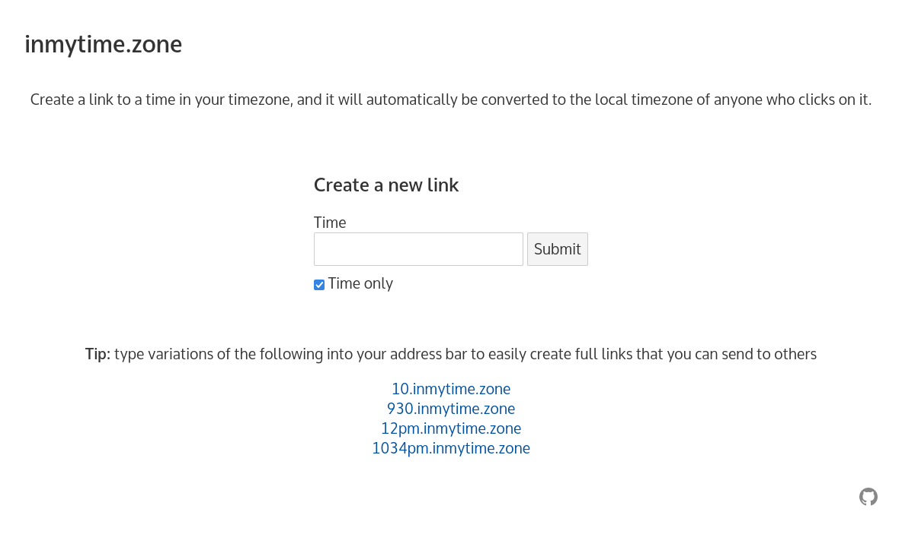
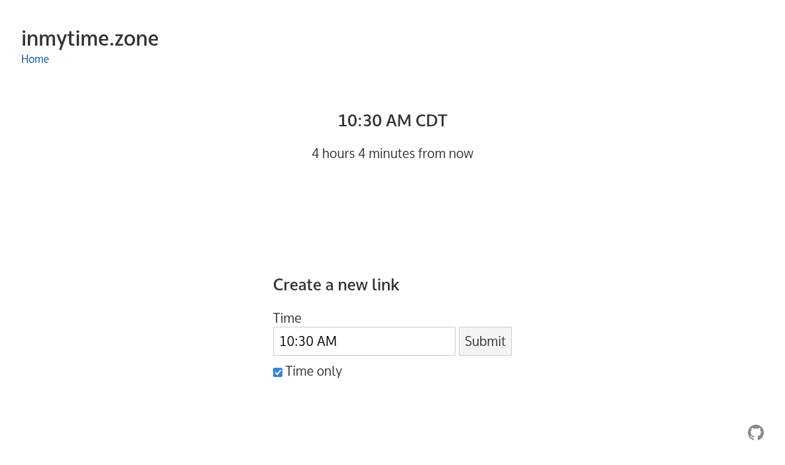

# inmytime.zone

A simple app to be explicit about what times you're referring to.

Selecting a date will create a link that will show your selected time (and
optionally date) in the recipient's local time zone.

Time-only links are useful for recurring events (e.g. "I'm free at 8am on Wednesdays"),
and links with dates are useful for specific events (and are less prone to
subtle timezone inconsistencies between locales). Time-only links are based on
the current date, assuming that time zones will respect daylight savings time
in tandem. Be wary around those boundaries when sharing time-only links to
those in areas that do not observe DST.

Time-only links can be created using an address shortcut such as
[10am.inmytime.zone](https://10am.inmytime.zone), which will create the
corresponding link automatically. Be sure to do this in your own locale and
send the full generated link to your recipient, else they'll simply end up
seeing their own time zone information.

**_Disclaimer_**: Time zones are very hard with subtle inconsistencies between locations and
across time periods, and this app has not been extensively tested.
Please double check correctness before using it for critical events (and opt to
include the date if possible for maximum safety).
